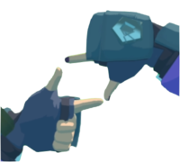

# Rumble Animator
Rumble Animator is a replay and animation system for RUMBLE VR that records scenes into a Brotli-compressed binary format and allows them to be replayed in-game.

It is primarily intended for:
- Match analysis
- Animation and cinematic capture
- Debugging gameplay behavior
- External tooling (via the replay format)

---

## How to use
### Recording
- To record automatically, enable Auto Record Matches or Auto Record Parks in the mod settings.
- To record manually, you can hold the custom hand gesture below for 3 seconds. You will here a clicking sound:  

- You can also do this same hand gesture again to stop and save the recording.

### Replay Buffer
If the Replay Buffer is enabled
- The mod continuously stores the last N seconds of gameplay (you can configure the duration).
- To save the buffer, press both buttons on the controller side you've chosen

### The Replay Table
You will find the Replay Table near the region selector in Gym. You can press the left and right arrow buttons to scroll through your stored replays.  
Holding the button below the name of the replay will load you into the replay in it's specific map.

The info that is shown when a replay is selected is based off of your format inside of `UserData/MatchReplays/MetadataFormats/`
There are separate formats for Gym, Park, and Matches. This uses a tag-based system for naming. The tags are provided inside the file.

The auto-naming configs inside of `UserData/MatchReplays/AutoNameFormats` also uses the same tag-based system. This will be the name that replays show on the Replay Table.

The button on the side of the table is the Crystalize button. Holding this button will put the replay into a crystal, which can be put anywhere around the gym.  
To load back the replay using these crystals, you can put (or throw) it back on top of the table. It will then be read and show the replay it had stored.

---

### Features
- Records player, structure, and pedestal transforms
- Delta-compressed per-field binary frames
- Brotli-compressed replay stream inside a `.replay` container (ZIP)
- `manifest.json` metadata included for each replay
- Imhex pattern file for inspecting replays
- Replay buffer with customizable duration and controller-based trigger
- Auto-recording support for matches and parks
- Custom gesture for starting/stopping a recording
- Replay Table in Gym for browsing, selecting, and loading replays
- Crystals for saving and placing replays physically in the world
- Metadata and title generation from configurable format files

---

## Replay Format
The replay format is documented [here](ReplayFormat)

- [Binary format spec](ReplayFormat/README.md): `ReplayFormat/README.md`
- [ImHex pattern](ReplayFormat/ReplayFile.hexpat): `ReplayFormat/ReplayFile.hexpat`

External tools can read replays using the documented format.