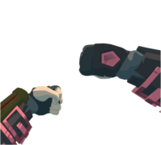

# Replay Mod
Replay Mod is a replay and animation system for RUMBLE VR. It records gameplay into a Brotli-compressed binary format and allows replays to be viewed in-game.

It can be used for:
- Match analysis
- Animation and cinematic capture
- Debugging gameplay behavior
- External analysis or tooling using the provided replay format

---

## How to use
### Recording
You can start recording in two ways:  
- **Automatic**: Enable `Auto Record Matches` or `Auto Record Parks` in the mod settings.
- **Manual**: Hold the custom hand gesture for 3 seconds. You'll hear a clicking sound along with a corresponding VFX when a recording starts.  

Doing the gesture again will stop and save the recording.

---

### Replay Buffer
If enabled, the replay buffer continuously records the last few seconds of gameplay.
- The duration of the buffer can be configured in the mod settings.
- To save the current buffer, press both buttons on the controller side you've selected.
- A pop sound and a haptic vibration (if enabled) will play when saved.

---

### Replay Table
The Replay Table appears near the region selector in Gym.
- Use the left/right arrows to scroll through saved replays.
- Hold the Load button under the replay name to load into it's map and view the replay.
- Replay names and metadata display according to the formats defined in:
  - `UserData/ReplayMod/Settings/MetadataFormats`
  - `UserData/ReplayMod/Settings/AutoNameFormats/`

These use tag-based templates. Tags are documented in the files themselves.

### Crystals
Holding the Crystallize button on the side of the Replay Table will turn the currently selected replay into a physical crystal
- Crystals can be held and placed anywhere in the Gym.
- Throwing a crystal back onto the table will select the replay it contains.

---

### Playback Controls
While a replay is playing, you can toggle the playback panel by doing the following gesture:  
  
This opens a control menu with:
- A timeline that shows current time and total duration
- You can scrub through the replay by dragging your finger along the timeline
- Playback speed controls:
  - `+0.1`, `-0.1`, `+0.1`, `+1`
- Play / Pause toggle
- Stop replay
- Exit scene

This panel can also be punched to toggle it off.

Alternatively, you can also do this gesture to toggle pause:  

---

### Timeline Markers
The timeline will show markers at key moments. These markers can be toggled individually in the mod settings:
- Red: Large Damage
- Black: Match Ended
- Purple: Round Ended
- White: Manual Marker

---

### POV Mode
You can view the replay from any recorded player's perspective:
- Tap the POV button on the Playback Controls to open the player selector.
- A slide-out panel will appear with a list of players
- Tap a player to switch to their perspective

You can also toggle Hide Local Player to remove your avatar while viewing through a player's POV.  
The legacy camera must be enabled for POV mode to work.

---

### Replay Settings Panel
Once a replay is selected, a second panel appears with tools for managing the file:
- Timeline and duration display
- The timeline here also can be dragged with your finger when the replay is loaded
- Rename button (with keyboard input)
- Copy path button
- Delete button

---

## Replay Format
The replay format is documented [here](ReplayFormat)

- [Binary format spec](ReplayFormat/README.md): `ReplayFormat/README.md`
- [ImHex pattern](ReplayFormat/ReplayFile.hexpat): `ReplayFormat/ReplayFile.hexpat`

External tools can read replays using the documented format.
